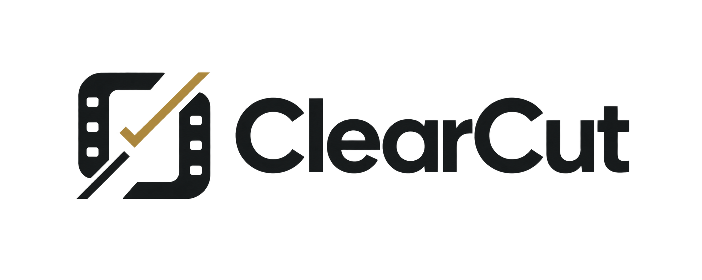

# ClearCut

**AI rights clearance for film and television.**

<p align="center">
  
</p>

<p align="center"><em>ClearCut turns scripts and rough cuts into evidence-backed rights intelligence—finding protected assets, researching ownership with Parallel, and routing every decision to a human reviewer.</em></p>


ClearCut turns a screenplay, shot list, or rough cut into a structured rights-clearance plan. It identifies potentially protected assets, researches likely ownership and licensing signals, ranks risk with explainable evidence, and prepares the next human-approved action.

> ClearCut helps teams prepare and manage rights-clearance work. It does not provide legal advice or declare an asset legally cleared.

## Project status

This repository contains the verified hackathon release candidate for Agentic Cinema. The deployed Google Cloud and Parallel integrations, authenticated workspace, media ingestion, research, review, permission-work, audit, and reporting flows have been exercised end to end.

The current release includes Firebase/Identity Platform authentication and RBAC, a tabbed project workspace, styled reports and PDF export, submission brand assets, video/audio ingestion, Gemini media analysis, live Parallel research, structured Gemini clearance cards, and human approval workflows. Media is uploaded to Cloud Storage, analyzed through the review-gated workflow, and represented as timestamped rights signals. See [CONTRIBUTING.md](CONTRIBUTING.md) for repository conventions, [docs/12-batch-release-plan.md](docs/12-batch-release-plan.md) for the release process, and [docs/13-operations-runbook.md](docs/13-operations-runbook.md) for operating procedures.

## Primary partner track

**Parallel** — used for web search, content extraction, deep research, and monitoring of rights-related sources. See the [partner-track decision record](docs/decisions/0001-partner-track.md).

## Product flow

```text
Script / shot list / video / audio rough cut
          ↓
Rights-bearing asset inventory
          ↓
Evidence-backed research
          ↓
Risk and confidence assessment
          ↓
Human review and approval
          ↓
Clearance report + outreach actions
```

## Planning documents

- [Product brief](docs/01-product-brief.md)
- [Technical brief](docs/02-technical-brief.md)
- [Architecture](docs/03-architecture.md)
- [Data model](docs/04-data-model.md)
- [Security and privacy](docs/05-security-privacy.md)
- [Roadmap and backlog](docs/06-roadmap.md)
- [Hackathon demo script](docs/07-demo-script.md)
- [Repository standards](docs/08-repository-standards.md)
- [Open questions and decisions](docs/09-open-questions.md)
- [Partner-track decision](docs/decisions/0001-partner-track.md)
- [Tooling, accounts, and credential readiness report](docs/10-tooling-and-credentials-report.md)
- [Deployment infrastructure](infra/README.md)
- [Batch release plan](docs/12-batch-release-plan.md)
- [Operations runbook](docs/13-operations-runbook.md)
- [Video and audio ingestion design](docs/14-video-ingestion.md)
- [Hackathon compliance checklist](docs/15-hackathon-compliance.md)
- [Devpost submission draft](docs/17-devpost-submission.md)

Authentication configuration is documented in [infra/README.md](infra/README.md) and `.env.example`. The API uses Firebase/Identity Platform ID tokens outside local demo mode; never commit Firebase service-account keys or token values.

## Brand assets

- [Primary logo](assets/brand/clearcut-logo.png)
- [Favicon and app mark](assets/brand/clearcut-favicon.png)
- [Devpost submission thumbnail](assets/brand/clearcut-devpost-thumbnail.png)

## Product capabilities

### Workspace and project operations

- Bright, responsive workspace shell with overview, projects, review queue, research, reports, activity, and settings.
- Dedicated project workspace areas for the command center, source versions, rights inventory, review, research, permission requests, reports, activity, and project settings.
- Dashboard metrics derived from workspace records rather than hard-coded presentation values.
- Project status, source versions, asset counts, blockers, evidence coverage, and delivery-readiness signals.
- Searchable multi-select project setup with workspace-managed project types, territories, and distribution modes.
- Loading, empty, retry, partial, error, and completed states for the main workflows.

### Authentication and workspace access

- Firebase/Google Identity Platform authentication for shared environments.
- Google sign-in, email/password registration, email/password sign-in, and password reset.
- First-user workspace creation.
- Email-based workspace invitations; invited users sign in with the invited email and are connected automatically.
- Verified Firebase ID tokens, tenant-scoped API requests, and server-side membership checks.
- Supported roles: admin, producer, coordinator, legal_reviewer, post_supervisor, and viewer.
- Explicit demo mode for local development and deterministic demos. Demo headers are never a production authentication mechanism.

### Source intake and analysis

- UTF-8 Markdown and plain-text screenplay upload.
- SHA-256 source identity and source-version tracking.
- Scene-aware extraction of candidate rights-bearing assets.
- Video support for MP4, MOV, WebM, Matroska, and MPEG/MPG.
- Audio support for MP3, WAV, M4A, and OGG.
- Small multipart uploads for local development and resumable browser uploads to Cloud Storage for production media.
- Vertex Gemini media analysis for transcripts, summaries, durations, timestamped segments, and visible/audible rights signals.

### Research, review, and delivery

- Typed Parallel Search and Extract provider adapter with a deterministic fixture implementation.
- Live Parallel research mode for rights-related source discovery and evidence extraction.
- Vertex Gemini clearance-card generation through Google ADK `Agent` and Vertex `AdkApp` in hosted agent mode.
- Evidence-backed clearance cards containing risk, confidence, reason codes, summary, recommendation, and source count.
- Research sessions, child tasks, provider request IDs, quality tiers, evidence gaps, rechecks, and retryable failures.
- Human approval decisions, notes, actor identity, timestamps, escalation, rejection, and re-review history.
- Reviewable permission-request drafts that are never sent automatically.
- Versioned Markdown and styled PDF reports with evidence snapshots and decision history.
- Audit events for uploads, analysis, research, evidence changes, decisions, invitations, requests, and report generation.

## End-to-end workflow

1. Create or join a production workspace.
2. Create a project with format, territories, distribution modes, and release context.
3. Upload a screenplay, rough cut, video, audio source, or supporting material.
4. Start analysis and wait for an awaiting_review or completed result.
5. Inspect the scene or timestamp, extraction confidence, and candidate rights signal.
6. Run research for an asset or a research angle.
7. Compare evidence, source quality, freshness, conflicts, and missing rights information.
8. Review the clearance card and record a human decision.
9. Draft a permission request or escalate the item to legal.
10. Generate the report, inspect the snapshot, and download the branded PDF.

## Architecture

~~~text
                         +-------------------------+
                         | Next.js web workspace   |
                         | Firebase client auth    |
                         +------------+------------+
                                      | HTTPS + ID token
                                      v
                         +-------------------------+
                         | FastAPI application     |
                         | tenancy + RBAC          |
                         | workflow API            |
                         +------+----------+-------+
                                |          |
                   transactions |          | research / analysis
                                v          v
                    +-------------+  +----------------------+
                    | Cloud SQL   |  | Agent runtime        |
                    | PostgreSQL  |  | Vertex Gemini        |
                    | + Alembic   |  | Parallel adapter     |
                    +-------------+  +-----------+----------+
                                                   |
                                      +------------v-----------+
                                      | Evidence, risk,        |
                                      | approvals, reports     |
                                      +-------------------------+

        Original documents and media -> Cloud Storage
        Secrets and keys               -> Secret Manager
        Container images               -> Artifact Registry
        Runtime                         -> Cloud Run
~~~

### Technology stack

| Area | Technology | Responsibility |
| --- | --- | --- |
| Web | Next.js 15, React 19, TypeScript | Responsive workspace and authenticated client workflows |
| API | Python, FastAPI, Pydantic | HTTP API, tenancy, authorization, and workflow boundaries |
| Persistence | SQLAlchemy, Alembic, PostgreSQL | Durable workspace, evidence, report, and audit state |
| Local persistence | SQLite | Lightweight local development default |
| Object storage | Google Cloud Storage | Original documents, media, and derived artifacts |
| Research | Parallel Search and Extract adapter | External rights-source discovery and extraction |
| Model runtime | Vertex Gemini / Google ADK / Google Gen AI | Media understanding and clearance-card generation |
| Identity | Firebase / Google Identity Platform | Google and email/password authentication |
| Hosting | Cloud Run | Web and API services plus migration job |
| Delivery | Cloud Build and Artifact Registry | Reproducible image builds and versioned releases |
| Secrets | Secret Manager | Database password and Parallel API key references |

## Hackathon compliance

ClearCut is built for the Parallel partner track. The deployed research workflow actively calls Parallel Search and Extract through the server-side adapter in `services/api/src/clearcut_api/providers/parallel_api.py`, with the API key kept in Secret Manager.

The hosted clearance workflow uses Google ADK's `Agent` and Vertex `AdkApp` in `services/api/src/clearcut_api/adk_agent.py`, with Gemini running on Vertex AI. Google Cloud Run hosts the web and API services; Cloud SQL stores application state; Cloud Storage stores source documents and media; Cloud Build and Artifact Registry provide the release path.

The repository is released under the OSI-approved Apache License 2.0. Demo fixtures and submission media must remain synthetic or owned by the team: no third-party music, footage, logos, or advertising should be included in the judging video. ClearCut provides rights-workflow triage and evidence organization, not legal advice or a legal-clearance decision.

## Repository layout

~~~text
clearcut-rights-agent/
├── apps/web/                         # Next.js workspace and route-level UI
├── services/api/                     # FastAPI service, agent tools, migrations, tests
├── packages/contracts/               # Shared TypeScript contract types
├── assets/brand/                     # Logo, favicon, and Devpost thumbnail
├── fixtures/scripts/                 # Synthetic screenplay fixtures
├── fixtures/expected/                # Expected extraction/evaluation output
├── infra/                            # Cloud Build, Docker, storage, and deployment config
├── docs/                             # Product, architecture, security, and runbooks
├── .env.example                      # Safe configuration template
├── Makefile                          # Common developer commands
└── README.md                         # Project overview and contributor entry point
~~~

## Local development

### Prerequisites

- Python 3.11 or newer.
- Node.js 22 and npm.
- Git.
- Docker, only if you want the local PostgreSQL compose service.
- Google Cloud CLI, only for hosted deployment and Cloud Run operations.

### Install

Run from the repository root:

~~~bash
python3 -m venv .venv
source .venv/bin/activate
pip install -e 'services/api[dev,agent]'
npm ci
cp .env.example .env
mkdir -p .data
~~~

The API reads the root .env through python-dotenv. Next.js reads public client variables when the web process starts. For non-default local web configuration, mirror the NEXT_PUBLIC variables into apps/web/.env.local or export them before starting the web app.

### Start the API

The default local profile uses SQLite, demo authentication, local uploads, fixture research, and deterministic fixture analysis.

~~~bash
source .venv/bin/activate
alembic -c services/api/alembic.ini upgrade head
make api-dev
~~~

The API runs at http://localhost:8000. OpenAPI documentation is available at http://localhost:8000/docs.

### Start the web app

In a second terminal:

~~~bash
npm run web:dev
~~~

The web workspace runs at http://localhost:3000. In demo mode the UI uses the demo-org workspace and demo-user actor and labels fixture-backed behavior clearly.

### Optional local PostgreSQL

~~~bash
docker compose -f infra/docker-compose.dev.yml up -d
~~~

Set the database variables in .env to match the compose service before running the Alembic migration.

## Configuration

ClearCut separates local resilience from shared-environment behavior.

### Local fixture profile

~~~dotenv
ENVIRONMENT=development
AUTH_MODE=demo
NEXT_PUBLIC_AUTH_MODE=demo
PARALLEL_MODE=fixture
AGENT_MODE=fixture
STORAGE_BACKEND=local
DATABASE_URL=sqlite:///./.data/clearcut.db
~~~

Fixture mode is deterministic and is intended for tests, screenshots, demos, and development without external credentials. It must not be presented as live research evidence.

### Hosted profile

~~~dotenv
ENVIRONMENT=staging
AUTH_MODE=identity_platform
NEXT_PUBLIC_AUTH_MODE=identity_platform
PARALLEL_MODE=live
AGENT_MODE=vertex
STORAGE_BACKEND=gcs
~~~

The complete safe template is in .env.example. The main variables are:

| Variable | Used by | Purpose |
| --- | --- | --- |
| NEXT_PUBLIC_API_URL | Web | API origin compiled into the Next.js client bundle |
| NEXT_PUBLIC_AUTH_MODE | Web | demo locally or identity_platform when hosted |
| NEXT_PUBLIC_FIREBASE_API_KEY | Web | Firebase web app public configuration |
| NEXT_PUBLIC_FIREBASE_AUTH_DOMAIN | Web | Firebase web app public configuration |
| NEXT_PUBLIC_FIREBASE_PROJECT_ID | Web | Firebase project used by the client |
| NEXT_PUBLIC_FIREBASE_APP_ID | Web | Firebase web app public configuration |
| AUTH_MODE | API | API authentication mode |
| AUTH_AUDIENCE | API | Firebase token audience |
| DATABASE_URL | API | Local database URL; omit in Cloud Run with Cloud SQL variables |
| DATABASE_NAME, DATABASE_USER, DATABASE_PASSWORD | API | Managed PostgreSQL connection values |
| CLOUD_SQL_CONNECTION_NAME | API | Cloud SQL Unix-socket connection name |
| PARALLEL_MODE | API | fixture or live research provider |
| PARALLEL_API_KEY | API | Live Parallel credential; use Secret Manager when hosted |
| AGENT_MODE | API | fixture or vertex analysis runtime |
| GEMINI_MODEL | API | Vertex Gemini model name |
| GOOGLE_CLOUD_PROJECT | API | Google Cloud and Firebase project ID |
| GOOGLE_CLOUD_LOCATION | API | Vertex and Cloud Run region |
| STORAGE_BACKEND | API | local or gcs object storage |
| GCS_BUCKET_NAME | API | Cloud Storage bucket for source and media objects |
| WEB_ALLOWED_ORIGINS | API | Browser origins allowed by CORS |
| MAX_MEDIA_UPLOAD_BYTES | API | Multipart fallback limit |
| MAX_MEDIA_SIZE_BYTES | API | Resumable media object limit |

Firebase web configuration is public client configuration. Service-account keys, access tokens, refresh tokens, database passwords, and Parallel API keys are secrets and must never be committed.

## Authentication and RBAC

In Identity Platform mode:

1. A user signs in with Google or email/password through Firebase.
2. The web client obtains a Firebase ID token.
3. The API verifies the token issuer, audience, and subject.
4. The API loads memberships for the verified actor.
5. The user selects a workspace when they belong to more than one.
6. Every protected resource query is scoped to that workspace.

The first authenticated user can create a workspace and becomes its administrator. An administrator invites a teammate by email and role from Workspace settings. The teammate signs in with that same email; no Firebase UID needs to be exchanged through the UI.

| Role | Typical responsibility |
| --- | --- |
| admin | Workspace membership, invitations, integrations, and administration |
| producer | Production setup, project operations, review coordination, and delivery |
| coordinator | Intake, research operations, inventory maintenance, and follow-up work |
| legal_reviewer | Evidence review, escalation, and rights decision support |
| post_supervisor | Media/source workflow and post-production context |
| viewer | Read-only workspace access |

The API is the source of truth for authorization. UI controls are not security boundaries.

## API surface

The complete API contract is published by FastAPI at /docs and /openapi.json. The main resource groups are:

~~~text
GET    /health
GET    /healthz
GET    /readyz
GET    /v1/auth/me

POST   /v1/organizations
GET    /v1/organizations/current/members
GET    /v1/organizations/current/invitations
POST   /v1/organizations/current/invitations
GET    /v1/organizations/current/project-options
POST   /v1/organizations/current/project-options
POST   /v1/organizations/current/api-keys

POST   /v1/projects
GET    /v1/projects
GET    /v1/projects/{project_id}
GET    /v1/projects/{project_id}/documents
POST   /v1/projects/{project_id}/documents
POST   /v1/projects/{project_id}/media
POST   /v1/projects/{project_id}/media-uploads
POST   /v1/documents/{document_id}/complete-upload
POST   /v1/projects/{project_id}/analysis-runs
GET    /v1/jobs/{job_id}

GET    /v1/projects/{project_id}/assets
GET    /v1/assets/{asset_id}
GET    /v1/assets/{asset_id}/clearance-card
POST   /v1/assets/{asset_id}/research-runs
POST   /v1/assets/{asset_id}/approvals
POST   /v1/assets/{asset_id}/outreach-drafts

GET    /v1/projects/{project_id}/research-sessions
POST   /v1/projects/{project_id}/research-sessions
POST   /v1/research-rechecks/run-due
GET    /v1/research-runs/{run_id}

GET    /v1/projects/{project_id}/reports
POST   /v1/projects/{project_id}/reports
GET    /v1/projects/{project_id}/reports/{report_id}
GET    /v1/projects/{project_id}/reports/{report_id}/pdf
GET    /v1/review-shares/{share_token}
~~~

All protected endpoints are tenant-scoped. Mutating endpoints enforce role checks and write audit events where the action changes workspace or rights state.

## Media ingestion

Production media follows this path:

~~~text
Browser selects media
        ↓
API creates resumable Cloud Storage session
        ↓
Browser uploads directly to the asset bucket
        ↓
API finalizes and verifies the object
        ↓
Media analysis job runs through Vertex Gemini
        ↓
Transcript + timestamped signals become source evidence
        ↓
Existing research, review, approval, and reporting workflow
~~~

Supported formats and operational limits are documented in [docs/14-video-ingestion.md](docs/14-video-ingestion.md). Apply the browser upload CORS policy after the deployed web origin is known:

~~~bash
gcloud storage buckets update gs://$ASSET_BUCKET --cors-file=infra/gcs-media-cors.json
~~~

The current media path is complete for the hackathon release. Post-hackathon hardening can add deeper codec and duration validation, shot thumbnails, durable long-running job execution, lifecycle retention policies, and explicit deletion controls for large media.

## Testing and quality checks

~~~bash
source .venv/bin/activate
make api-test
make api-lint
make contracts-check
make web-build
git diff --check
~~~

The API test and lint commands expect the project virtual environment to be active. The Next.js production build performs the web type and build validation used for the release; `next lint` is deprecated in the current Next.js version and is not part of the release gate.

The canonical synthetic sample is [fixtures/scripts/the-last-signal.md](fixtures/scripts/the-last-signal.md). Its expected extraction output is [fixtures/expected/the-last-signal.json](fixtures/expected/the-last-signal.json).

For a hosted authenticated smoke test:

1. Sign in or create a Firebase account.
2. Create a workspace if the account has no membership.
3. Create a project such as The Last Signal.
4. Upload the fixture screenplay.
5. Start analysis and wait for awaiting_review or completed.
6. Research a candidate asset and inspect its sources.
7. Approve or escalate the asset with a note.
8. Draft a permission request.
9. Generate the report, view it, and download the PDF.
10. Upload a supported video or audio sample and repeat the source-to-review journey.
11. Verify that activity and workspace metrics reflect the real actions.

## Cloud deployment

The deployment shape is:

~~~text
Cloud Build -> Artifact Registry
Artifact Registry -> clearcut-api and clearcut-web images
Cloud Run job -> clearcut-db-migrate
Cloud Run service -> clearcut-api
Cloud Run service -> clearcut-web
Cloud SQL -> PostgreSQL application state
Cloud Storage -> source and media objects
Secret Manager -> database password and Parallel API key
~~~

The image build intentionally stops after publishing to Artifact Registry. Deployment is a deliberate release operation so migrations, configuration, revisions, and smoke checks can be recorded together.

Build both images with the production web API URL and Firebase public configuration:

~~~bash
PROJECT_ID=clearcut-rights-dev
REGION=us-central1
BUILD_TAG=staging-$(date +%Y%m%d%H%M%S)
gcloud builds submit . --config=infra/cloudbuild-images.yaml --substitutions="_TAG=$BUILD_TAG,_NEXT_PUBLIC_API_URL=$API_URL,_NEXT_PUBLIC_AUTH_MODE=identity_platform,_NEXT_PUBLIC_FIREBASE_API_KEY=$FIREBASE_API_KEY,_NEXT_PUBLIC_FIREBASE_AUTH_DOMAIN=$FIREBASE_AUTH_DOMAIN,_NEXT_PUBLIC_FIREBASE_PROJECT_ID=$PROJECT_ID,_NEXT_PUBLIC_FIREBASE_APP_ID=$FIREBASE_APP_ID,_NEXT_PUBLIC_FIREBASE_MESSAGING_SENDER_ID=$FIREBASE_MESSAGING_SENDER_ID" --project="$PROJECT_ID"
~~~

Run the migration job before routing the new images to traffic. The exact IAM, Secret Manager, Cloud SQL, Cloud Storage, CORS, and rollback procedures are documented in [infra/README.md](infra/README.md), [docs/12-batch-release-plan.md](docs/12-batch-release-plan.md), and [docs/13-operations-runbook.md](docs/13-operations-runbook.md).

### Runtime security contract

- Cloud Run uses the dedicated clearcut-runtime service account.
- The API reads database and provider secrets through Secret Manager references.
- Cloud SQL is accessed through its Unix socket connection name.
- The web edge may be public, but application data requires an authenticated Identity Platform token.
- Source material remains in private object storage; review links are scoped and revocable.
- No service-account key file belongs in the repository or container image.

## Release status and post-hackathon roadmap

The `v1.0.0-hackathon` release candidate covers authenticated workspace access, project and source management, script and media ingestion, agent-backed research, evidence and risk cards, human decisions, permission drafts, audit history, styled reports, and PDF export. The hosted release has passed the API test suite, API lint, TypeScript contract checks, production web build, Cloud Run health/readiness/CORS checks, and a fresh end-to-end research workflow.

For sustained use by a real studio beyond the hackathon, the highest-value hardening work is:

1. Add durable asynchronous execution, retry budgets, idempotency keys, and dead-letter handling for long media and research jobs.
2. Add ownership, assignees, due dates, saved filters, bulk operations, and delivery-readiness controls.
3. Harden media processing with codec/duration validation, thumbnails, retention, deletion controls, and larger-file tests.
4. Expand evaluation fixtures for source conflicts, prompt injection, unsupported certainty, stale evidence, and human corrections.
5. Add CI enforcement for tests, lint, type checks, dependency scanning, secret scanning, container scanning, migrations, and release smoke tests.
6. Complete backups, restore verification, alerting, cost limits, rate limiting, and incident response controls.

The hackathon proof is the core product loop; this list is the hardening path for sustained organizational use.

## Working with the repository

Read [CONTRIBUTING.md](CONTRIBUTING.md) before opening a change. UI changes should include screenshots or a recording, tests should be added where behavior changes, and migrations need rollback notes.

Never commit secrets, customer source material, Firebase service-account files, generated build output, or live provider responses containing sensitive content.


## License

ClearCut is released under the Apache License 2.0. See [LICENSE](LICENSE).
