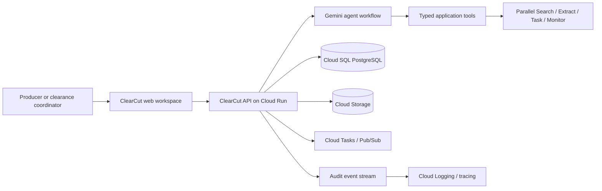
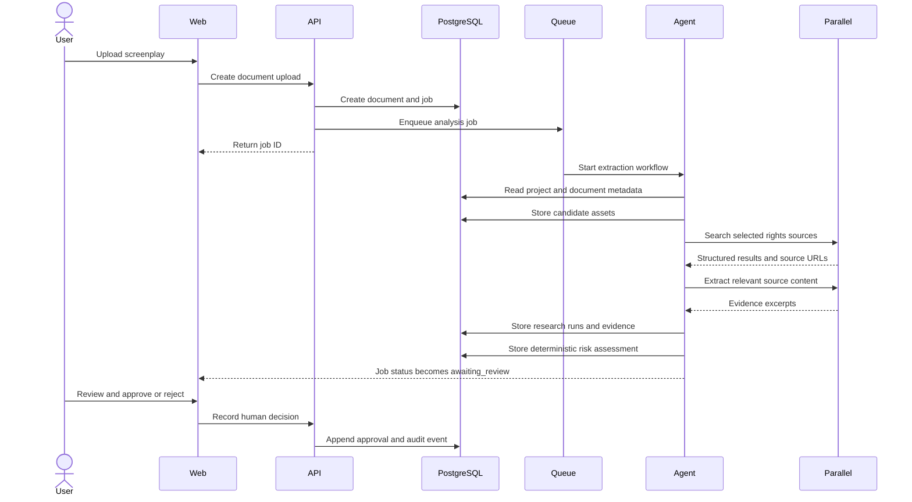

# ClearCut Architecture

## 1. System context

## 2. Logical components

### Web workspace

Owns navigation, project views, asset review, evidence display, approval forms, and report download. It never directly calls Parallel with a secret credential.

### API service

Owns authorization, validation, persistence, job creation, report requests, and domain invariants. It is the only public application boundary.

### Agent workflow service

Owns prompt assembly, tool selection, structured model outputs, and the finite-state analysis workflow. It receives only the minimum project context needed for the current step.

### Research adapter

Owns authentication, retries, rate limits, provider-specific request mapping, response normalization, and source evidence extraction for Parallel.

### Worker service

Owns asynchronous asset analysis, source extraction, monitoring setup, and report generation. Workers must be idempotent.

### Persistence layer

PostgreSQL stores the source of truth for structured project state. Cloud Storage stores immutable or versioned files. All references between the two are explicit.

## 3. Request flow: script analysis

## 4. Trust boundaries

1. **Browser boundary:** treat all browser input as untrusted.
2. **Uploaded document boundary:** parse in isolated workers; never execute embedded content.
3. **Web source boundary:** treat retrieved text as untrusted data and prompt-injection material.
4. **Agent boundary:** allow only registered tools with schema validation and authorization checks.
5. **Provider boundary:** keep Parallel credentials server-side and normalize provider responses.
6. **Tenant boundary:** every query must be scoped by organization and project authorization.

## 5. Source provenance

Every research claim shown in the UI should be traceable to:

- the research run;
- provider operation and request ID, when available;
- source URL;
- retrieval timestamp;
- source title and domain;
- exact excerpt or normalized evidence;
- model and prompt version used for summarization;
- human decision, if any.

## 6. Failure behavior

### Provider timeout

Mark the child task retryable, preserve the partial run, and show the user that evidence is incomplete.

### Conflicting sources

Do not collapse the conflict into a single owner. Create an `insufficient_evidence` or `needs_review` status with both source records.

### Model failure

Fall back to a structured error state. Never silently substitute a fabricated result.

### Duplicate upload

Hash the object and offer to link to the existing document version rather than silently creating duplicate work.

## 7. Deployment environments

### Development

Local services or emulators, fixture provider mode, seeded database, verbose structured logs.

### Staging

Separate Google Cloud project, real Parallel sandbox or low-volume credentials, masked fixtures, end-to-end smoke tests.

### Production

Separate project and credentials, managed migrations, backups, alerting, restricted egress, SSO-ready identity, and audited operational access.

