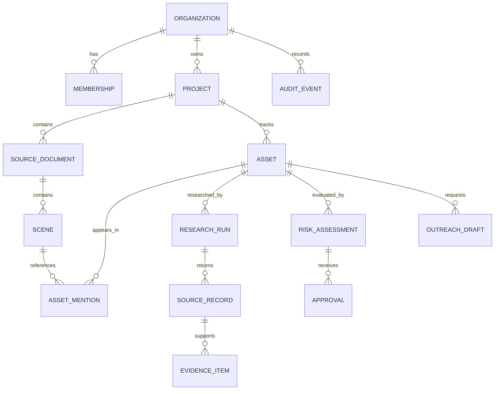

# ClearCut Data Model

## 1. Modeling principles

- Keep creative source material immutable and versioned.
- Keep extracted assets separate from evidence and decisions.
- Never overwrite a research run; create a new run.
- Treat human decisions as append-only events with optional supersession.
- Scope every business record to an organization.

## 2. Core entities

### Organization

Represents a studio, production company, agency, or legal team.

Key fields: `id`, `name`, `slug`, `default_policy_id`, `created_at`.

### User and membership

Users belong to organizations through memberships with roles such as `owner`, `producer`, `clearance_coordinator`, `legal_reviewer`, and `viewer`.

### Project

Represents a film, series, episode, campaign, or delivery package.

Key fields: `id`, `organization_id`, `title`, `type`, `territories`, `distribution_modes`, `target_release_at`, `status`.

### Source document

An uploaded screenplay, treatment, shot list, subtitle file, cue sheet, or exported review document.

Key fields: `id`, `project_id`, `version`, `object_uri`, `content_hash`, `mime_type`, `created_by`, `created_at`.

### Scene

A navigable location within a source document or future media review timeline.

Key fields: `id`, `document_id`, `scene_number`, `heading`, `page_start`, `page_end`, `timecode_start`, `timecode_end`.

### Asset

A candidate rights-bearing item, such as music, brand, location, artwork, person, archive, or organization.

Key fields: `id`, `project_id`, `canonical_name`, `category`, `normalized_identifier`, `first_seen_at`, `current_status`.

### Asset mention

The contextual occurrence of an asset in one source. A single asset may appear in many scenes and document versions.

Key fields: `id`, `asset_id`, `scene_id`, `source_span`, `mention_type`, `extraction_confidence`.

### Research run

One provider-backed attempt to gather evidence for an asset.

Key fields: `id`, `asset_id`, `provider`, `operation`, `status`, `provider_request_id`, `started_at`, `completed_at`, `error_code`.

### Source record

A URL or other externally retrieved source associated with a research run.

Key fields: `id`, `research_run_id`, `url`, `domain`, `title`, `retrieved_at`, `source_quality`, `content_hash`.

### Evidence item

A normalized excerpt or structured fact extracted from a source.

Key fields: `id`, `source_id`, `claim_type`, `claim_text`, `excerpt`, `locator`, `evidence_confidence`.

### Risk assessment

The deterministic evaluation of an asset for a specific project context.

Key fields: `id`, `asset_id`, `policy_version`, `risk_status`, `risk_score`, `confidence_score`, `reason_codes`, `created_at`.

### Clearance card

The evidence-backed, human-reviewable recommendation generated for an asset and research run.

Key fields: `id`, `asset_id`, `research_run_id`, `status`, `risk_score`, `confidence_score`, `recommendation`, `reason_codes`, `evidence_count`, `needs_human_review`.

### Approval

A human decision on a risk assessment or proposed action.

Key fields: `id`, `asset_id`, `assessment_id`, `decision`, `decision_note`, `decided_by`, `decided_at`, `supersedes_id`.

### Outreach draft

A generated permission request awaiting review or delivery.

Key fields: `id`, `asset_id`, `recipient_hint`, `subject`, `body`, `status`, `approved_by`, `sent_at`.

ClearCut may generate a draft, but the current workflow does not send it automatically.

### Clearance report

An immutable Markdown snapshot of the project’s current assets, clearance cards, decisions, and cited evidence.

Key fields: `id`, `project_id`, `report_type`, `status`, `generated_by`, `content_markdown`, `created_at`.

### Audit event

An append-only record of security-relevant and business-relevant actions.

Key fields: `id`, `organization_id`, `actor_type`, `actor_id`, `action`, `resource_type`, `resource_id`, `metadata`, `created_at`.

## 3. Relationships

## 4. Status vocabulary

### Asset status

`new`, `researching`, `needs_review`, `high_risk`, `likely_clear`, `blocked`, `insufficient_evidence`, `approved_for_delivery`, `archived`.

### Research status

`queued`, `running`, `completed`, `partial`, `retryable`, `failed`, `cancelled`.

### Approval decision

`approve_next_action`, `request_more_research`, `mark_not_applicable`, `reject`, `escalate_to_legal`.

## 5. Retention

Retention must be configurable by organization and documented per record type. Deletion should be a workflow that records the deletion event while removing or anonymizing the underlying content according to policy.
